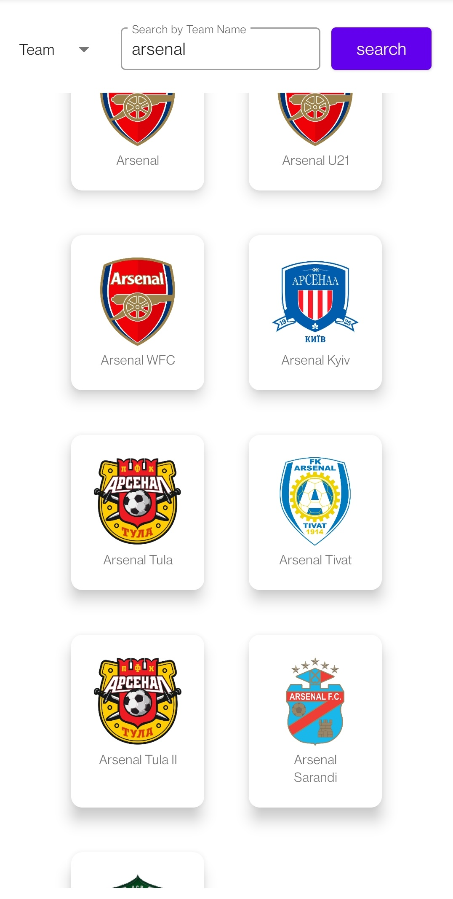
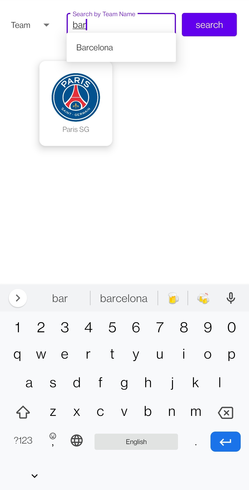
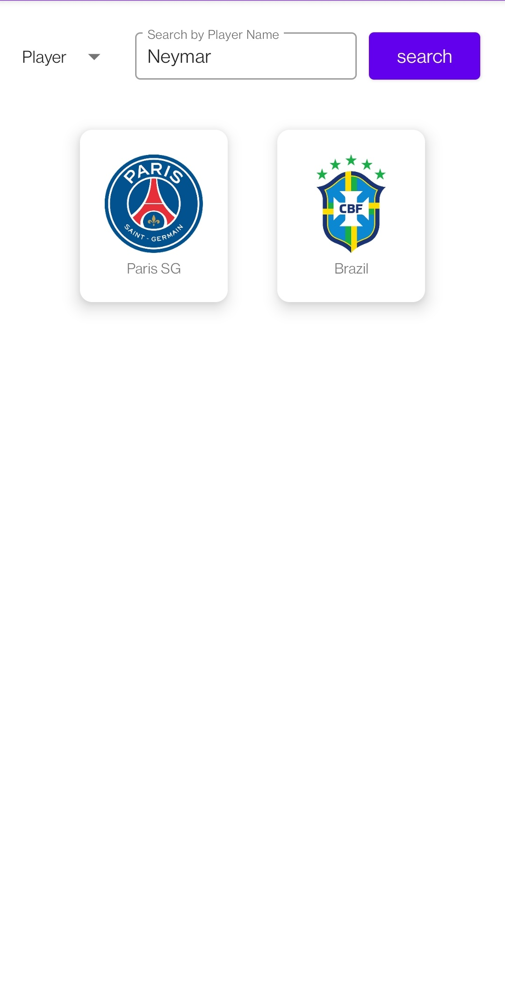
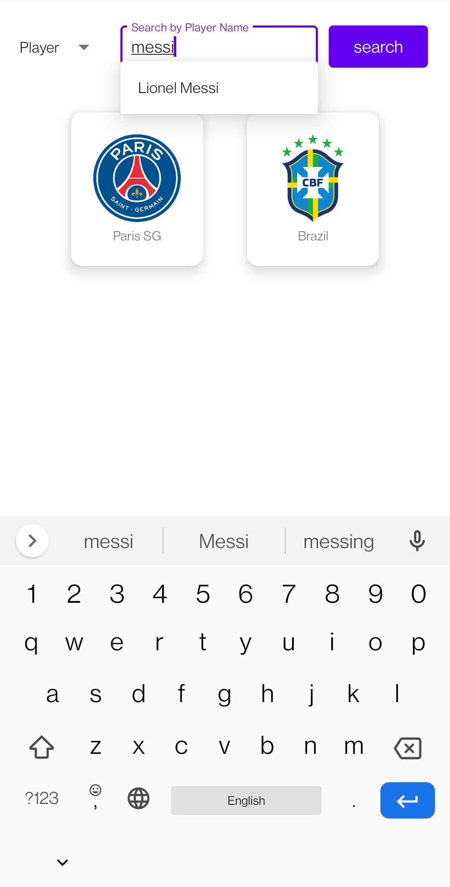
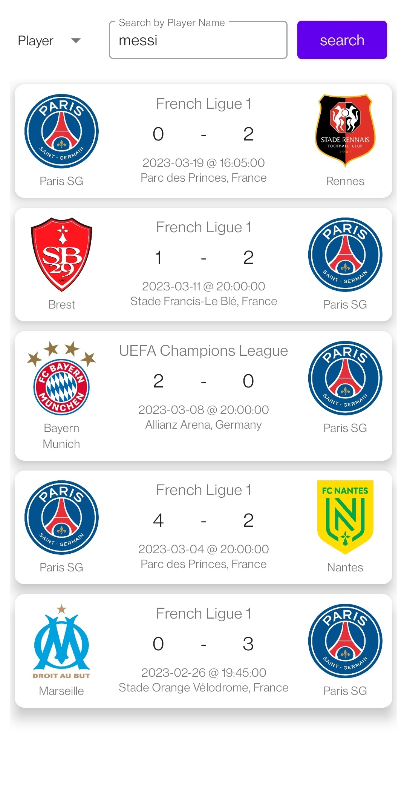
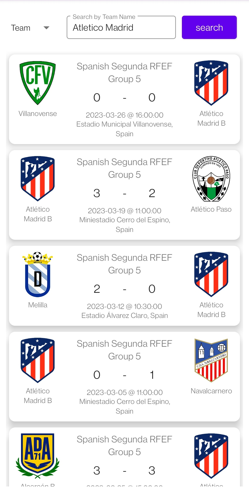

# Game Score Tracker

A sports game-history tracking app for users to view the history of games for their favorite teams in all sports.

This is an android project written in Kotlin. It uses the [TheSportsDB API](https://www.thesportsdb.com/api.php) for fetching the data.

## UI

Here are some screenshots:

  
  
  
  
  
  

